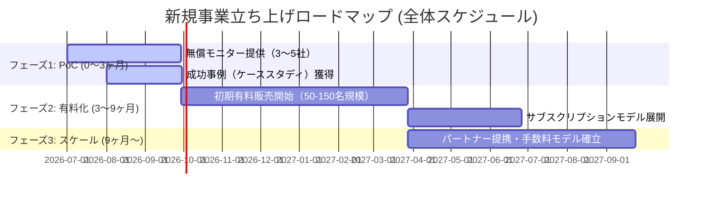

# 新規事業企画書：健康経営プレゼンティーズム可視化・改善事業（仮称）
### ーー 従業員の健康課題による「見えない生産性損失」を可視化し、企業の健康投資を最適化する新規B2B事業 ーー

---

## 1. エグゼクティブサマリー
本事業は、従業員が体調不良を抱えながら業務を行うことで生じる生産性損失（＝プレゼンティーズム）を学術的根拠に基づいて可視化し、改善施策の提案から環境投資の最適化までを一気通貫で支援する新しいB2B健康経営事業です。
自社開発した「低コスト・高機能アンケートシステム」を軸に、モニター検証から始めて顧客企業を獲得し、中長期的なサブスクリプション（SaaS）およびソリューション紹介手数料（マージン）での収益化を目指します。

---

## 2. 事業立ち上げの背景と市場の機会

### ① 社会的背景：健康経営優良法人認定の需要増加
経済産業省による健康経営の推進に伴い、「健康経営優良法人」の認定を目指す企業が急増しています。しかし、多くの企業が「アンケートをとったものの、どう改善して良いか分からない」「投資に対する効果が見えない」という課題を抱えています。

### ② 顕在化する「プレゼンティーズム」という巨大市場
欠勤や休職（アブセンティイズム）とは異なり、肩こり・腰痛・睡眠不足・メンタル不調を抱えながら仕事をしていることによる「生産性低下」は、企業にとって最大の隠れたコスト（健康関連コスト全体の約70%）です。これを「具体的な円単位の損失額」として可視化するサービスへのニーズは極めて高い状況にあります。

---

## 3. 事業内容（提供ソリューション）

本事業は、以下の3つの価値を顧客企業に提供します。

```
【本事業のソリューション構造】
┌────────────────────────────────────────────────────────┐
│ 1. サーベイ（回答負担最小限：スマホで約2分）           │
└─────────────────────────┬──────────────────────────────┘
                          ▼
┌────────────────────────────────────────────────────────┐
│ 2. 分析・可視化（QQ-methodに準拠した年間損失の『円』換算）│
└─────────────────────────┬──────────────────────────────┘
                          ▼
┌────────────────────────────────────────────────────────┐
│ 3. 解決策提案（オフィス環境の改善、理学療法士等の専門家介入）│
└────────────────────────────────────────────────────────┘
```

1.  **QQ-method公式準拠の測定システム**
    - 従業員の不調がもたらす生産性損失を「年間損失額（円）」として論理的に試算。経営陣・CFOに対して説得力のある健康投資の根拠を提供します。
2.  **組織別リアルタイム・ダッシュボードの提供**
    - 部署ごとの健康リスクやオフィス環境（机、椅子、照明等）への要望を自動で集計・視覚化し、人事部の業務負担を大幅に削減します。
3.  **改善ソリューション（介入支援）とのマッチング**
    - 分析で明らかになった最大の課題（例：腰痛・肩こり）に対して、姿勢改善プログラム、ストレッチセミナー、エルゴノミクス備品の導入などの具体的な解決策をレコメンドします。

---

## 4. ビジネスモデルと収益化プラン
本事業は、初期・月額の「サーベイシステム利用料」と、提携パートナーからの「改善プログラム紹介手数料」の2階建てで収益を上げます。

```
                    ┌──────────────┐
                    │  自社（弊社） │
                    └─┬──────────┬─┘
     システム利用料 / │          │ 紹介手数料（マージン）
     レポート提供料   │          │ (施策売上の15〜20%)
                      ▼          ▼
             ┌───────┐      ┌─────────────┐
             │ 顧客企業 │      │ 専門家 /    │
             │ (人事・  ├─────►│ オフィス家具 │
             │  経営層) │ 改善 │ パートナー  │
             └─────────┘ 施策 └─────────────┘
                         発注
```

### ① サーベイ利用料・レポート作成料（月額 / スポット）
- **ライトプラン（年1回実施）**：初期設計費＋診断レポート作成（スポット売上）
- **スタンダードプラン（年4回・定期実施）**：月額サブスクリプション（リアルタイムダッシュボードの常時閲覧・部署比較権限含む）

### ② 施策紹介手数料（パートナーアライアンス・高利益率）
ダッシュボードで検知された「肩こり・腰痛の多さ」「オフィスチェアーへの不満」などに対し、提携しているオフィス家具メーカー（エルゴノミクスチェア）や、整体師・理学療法士による社内フィットネス講座などのパートナーを仲介し、**成約金額の15%〜20%を紹介手数料（マージン）**として得る高収益モデルです。

---

## 5. 競合分析と自社の優位性

| 評価項目 | 他社の健康経営サーベイ | 本事業のサーベイ（自社） |
|---|---|---|
| **アウトプット** | 「総合評価：B」などの曖昧な指標 | 損失を**「年間〇〇万円」と円単位**で算出 |
| **回答負荷** | 80〜100問（回答に15分以上かかる） | **わずか7問・約2分**でスマホ回答完了 |
| **システム維持コスト** | 専用の巨大SaaSシステムのため高額 | GAS ✕ Reactのサーバーレス構成のため**超低コスト** |
| **セキュリティ** | IDの登録必須、プライバシーの懸念 | **無記名回答・ID任意**で本音を回収可能 |

---

## 6. 事業立ち上げ・発展ロードマップ

本事業は、リスクを最小限に抑えつつ、実績を作ってスケールさせる3フェーズで進めます。



### フェーズ1：モニター企業での検証と事例獲得（0〜3ヶ月）
*   まずは知り合いのベンチャー・中小企業3〜5社に「無料モニター（実証実験）」としてアプローチします。
*   「サーベイ結果によって、どこに健康課題があり、どれほどの損失があるか」の実データを取り、施策を実施する前のベースライン（基準値）を獲得します。

### フェーズ2：実績を活用した初期有料販売（3〜9ヶ月）
*   モニター企業での「損失の可視化」の実例を匿名化して「導入事例（ケーススタディ）」として資料化します。
*   「他社ベンチャーで年間〇〇万円のプレゼンティーズム削減に繋がった」という実績を最大のフックにし、有料（月額サブスクリプション）での本格販売を開始します。

### フェーズ3：ソリューションエコシステムの拡大（9ヶ月〜）
*   理学療法士、カウンセラー、オフィス什器メーカーなどとのアライアンス（提携）を完了させます。
*   顧客企業への改善提案（エルゴノミクス家具の販売や姿勢改善セミナーなど）から、高利益率の紹介手数料ビジネスへと発展させます。

---

## 7. プロジェクト推進に必要な体制とコスト
開発済みのシステム（React ✕ GAS）は維持コストがほぼ「ゼロ」であり、スモールスタートが可能です。

*   **開発・システム保守**：エンジニア1名（パートタイムで稼働可能）
*   **セールス・カスタマーサクセス**：営業1〜2名（モニターアプローチ、提案資料の送付、商談）
*   **システム維持費**：ほぼ無償（Vercelのホスティング無料枠、GoogleスプレッドシートおよびGASの利用枠内）
